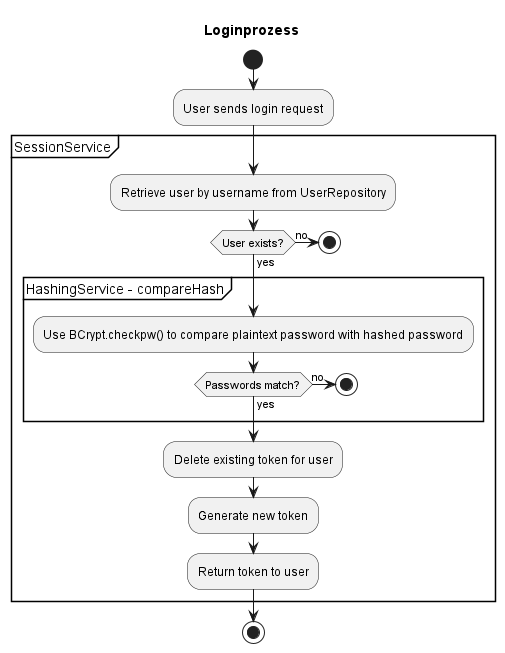

# Protokoll für SWEN Monster Trading Cards Game

## 1) Technische Schritte

### Design
- Beim Design habe ich mich sehr stark an die API-Spezifikationen und das Curl-File gehalten, da ich zu Beginn keinen klaren Überblick hatte.
- Ich habe Controller, Services und Repositories für die verschiedenen Ebenen erstellt. Im Controller wird nur die erwartete Handhabung durchgeführt, während im Service die Logik ausgeführt wird und über die Repositories mit der Datenbank kommuniziert wird.
- Mein Datenbankschema sieht folgendermaßen aus: 

- Fehlerfälle werden mit Exceptions behandelt, die in MtcgApp abgefangen werden, damit sie von überall ausgelöst werden können. Hierfür habe ich eine custom Exception (HttpStatusException) verwendet, die den HTTP-Status und die Message speichert und bei Bedarf ausgibt.

### Herausforderungen
- Am Anfang hatte ich Schwierigkeiten, dei Anforderungen zu verstehen und mich einzuarbeiten, was zu Verzögerungen beim Design führte. Jedoch konnte ich mich durch "Learning by doing" in die Materie einarbeiten und habe es dann nach einigen Anlaufversuchen verstanden. 
- Ich habe anfangs das Token-basierte Authentifizierungskonzept falsch verstanden, was zu Problemen mit dem Curl-File führte. Ich habe nicht verstanden, dass der Token im Header mitgesendet werden sollte, weswegen ich beim login ein User Objekt erstellt habe, dass nach 20 min automatisch zerstört wird, dies führte jedoch zu Fehlern beim curl Script. Nachdem ich das verstanden habe, habe ich einige Anpassungen (Header-Eigenschaft zum Requet hinzugefügt und beim mappen des Requests die Header-Logik implementiert) vorgenommen und es hat wie gewünscht funktioniert.
- Gelegentliche Schwierigkeiten mit Git, insbesondere beim Erstellen und Wechseln zwischen Branches. Hier habe ich anfangs bei der Erstellung des Repos Probleme gehabt, da sich der master Branch (von IntelliJ) und dann dr main Branch (vom Repo) nicht gut verstanden haben. Weiters hatte ich ab und zu das Problem, dass ich gewisse Files in einem anderen Branch committen wollte als im aktuellen. Hierfür habe ich "git stash" und "git stash pop" verwendet. Hierbei sind hin und wieder Files verloren gegangen. Den genauen Grund konnte ich nicht herausfinden, jedoch habe ich einfach angefangen besser zu kontrollieren, ob alle Files im stash sind.
- Zeitprobleme in der Datenbank: Beim Speichern in meiner DB hatte ich immer 1h Zeitunterschied. Dies aber nur, wenn es durch die MtcgApp oder in der IntelliJ console ausgeführt wurde. Dann dachte ich, dass es an der Datenbank liegt, dass hier evt. die falsche Zeitzone eingestellt ist. Mit pgAdmin habe ich dies ausprobiert und versucht CURRENT_TIMESTAMP einzufügen. Hier ist jedoch die richtige Zeit herausgekommen und in den Einstellungen habe ich sonst auch nichts gefunden, was auf eine falsche Zeitzone hindeuten könnte. Dann dachte ich, dass der Docker-Container evt. in einer falschen Zeitzone läuft. Ich habe einige commands ausprobiert. Diese haben jedoch nichts geändert. Dann dachte ich, dass es ja nurmehr an IntelliJ liegen kann. Hier habe ich jedoch in den Einstellungen nichts gefunden. Dann habe ich nochmal die DB genauer angesehen und bin auf das Problem gewstoßen. Bei "SHOW TIMEZONE" war "UTC" eingestellt. Mit SET timezone='CET' konnte ich es auf die richtige Zeitzone setzen und das Problem war gelöst.
- An einem Tag hatte ich Schwierigkeiten mit Hoppscotch, da es meine Requests immer 2x an den Server gesendet hat, was zu Problemen beim UNIQUE Contraint kam. Ich habe es auch mit der TaskApp ausprobiert und hier war das Gleiche. Bei einer Kollegin ebenfalls. Ich bin zwar nie auf eine Lösung gekommen, jedoch hatte Hoppscotch am nächsten Tag das Problem nicht mehr.

## 2) Unit Tests
- Für mich sind Unit-Tests ein wichtiger Bestandteil der Qualitätssicherung, da sie dazu beitragen, Probleme und Fehler im Code frühzeitig zu identifizieren, bevor sie in die Produktionsumgebung gelangen.
- Meine Unit-Tests haben sich auf verschiedene Teile meines Codes konzentriert: Controller, Services (und Repositories).
- Einige Beispiele für typische Testfälle, die ich geschrieben habe, sind:
    - Controller:
      - Testing der Routen. Werden die richtigen Routen von dem Controller unterstützt. z.B die Route /wheel soll vom WheelOfFortuneController supportet werden
      - Testing der Http-Methoden: Werden bei den ausgewählten Methoden auch die richtigen Funktionen aufgerufen z.B. wird beim UserController due Funktion createUser aufgerufen, wenn die Methode POST angewendet wird.
    - Service:
      - Hier habe ich die Logik getestet. 
      - BattleLogic: Für die BattleLogic habe ich getestet, ob es möglich ist bei einem Battle auch ein "draw" zu haben
      - BattleService: Im BattleService habe ich die Warteschlange getestet, wenn für einen Spieler kein Gegner gefunden wird oder wenn einer gefunden wird.
      - Exceptions: Stichprobenartig habe ich auch die Exceptions getestet, dass diese bei den richtigen Bedingungen geworfen werden.
      - Sonstige: Andere typische Tests überprüfen, ob meine Service-Logik richtig implementiert wurde und funktioniert bei unterschiedlichen Bedingungen
    - Repository:
      - Hier habe ich auch Stichprobenartig die Exceptions getestet
      - Zusätzlich habe ich bei manchen DB-Abfragen die richtige Verarbeitung getestet

## 3) Unique Feature
- Hashed Password
  - Wenn ein User sich einloggt, wird sein Passwort gehashed in die DB gespeichert. Anschließend werden bei jedem Login die Hash-Werte verglichen
  - Als Hashing-Alghorithmus habe ich bcrypt verwendet, da es so im Internet empfohlen wurde
  
  

- User Login
  - Wenn sich meine User einloggen, wird ein Token erstellt, der nur für 20min gültig ist. Danach muss er sich nochmal einloggen. 
  - Dies habe ich implementiert, damit ein gewisser Sicherheitsfaktor bei den mitgesendeten Auth-Headern besteht. Ein User sollte sich ja nicht nur einmal im Leben einloggen.
  - Man könnte es mit einer Session vergleichen.

- Wheel of fortune
  - Jeder User kann einmal am Tag das Glücksrad drehen und dabei entweder eine Karte oder Münzen gewinnen. Hat er Pech, so verliert er Münzen
  - Hier habe ich mit der Random-Library gearbeitet, um den Random-Faktor beim Glücksrad zu simulieren
  

## 4) Zeitaufzeichnung
- Ich habe im November und Dezember aufgrund anderer LVs kaum am Projekt gearbeitet.
- In den Weihnachtsferien habe ich etwa 1-2 Woche lang täglich 4-7 Stunden daran gearbeitet.
- Nach den Ferien habe ich im Durchschnitt täglich 1-3 Stunden am Abend daran gearbeitet, da ich abends am besten programmieren kann.

## 5) Git-Repo
https://github.com/helhar1234/MCTG_helhar_swen1